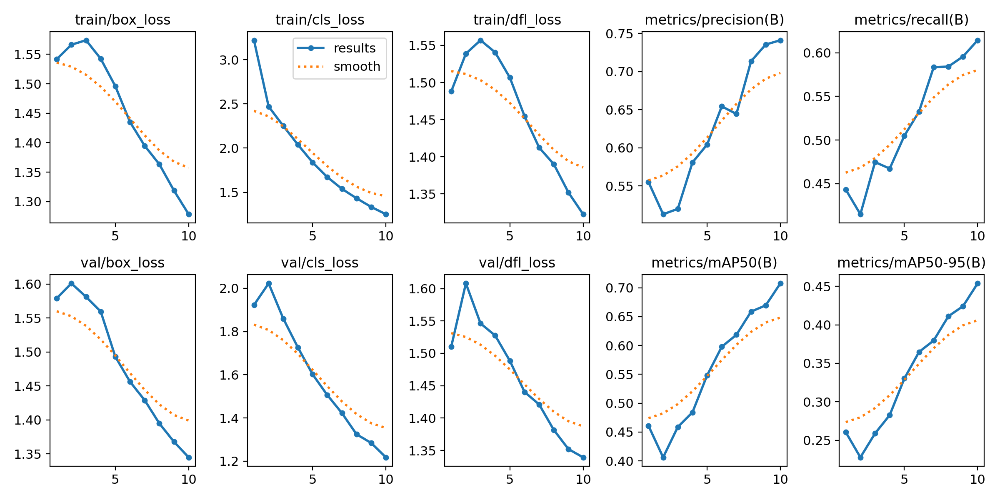
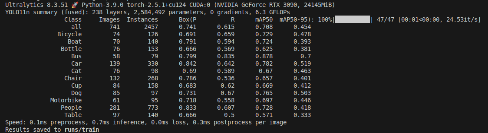
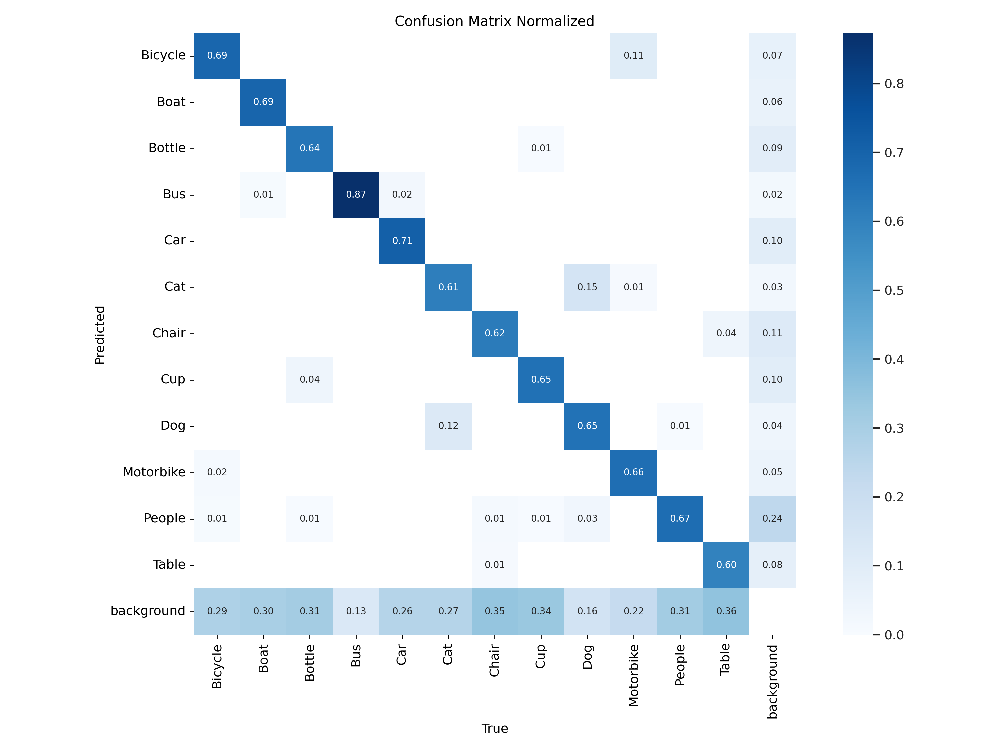
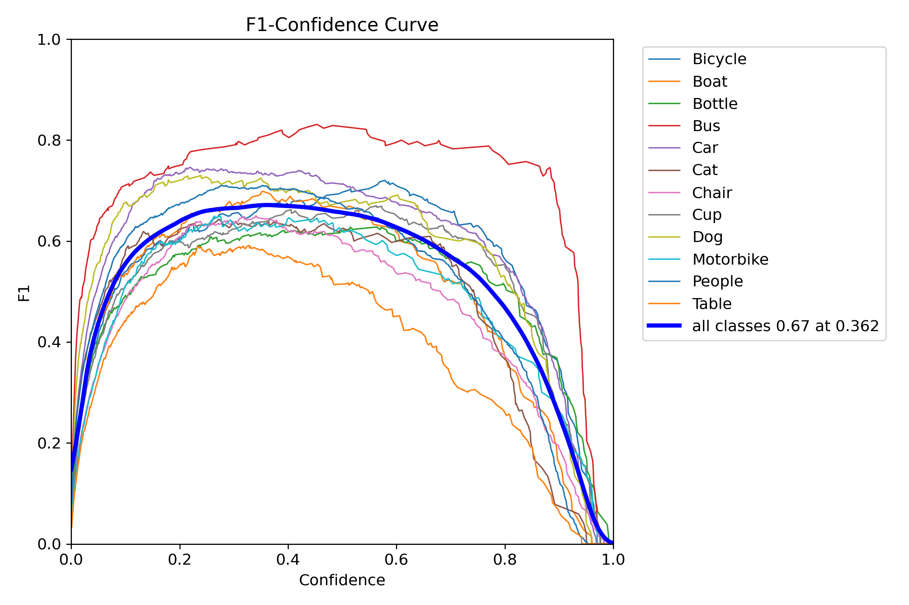
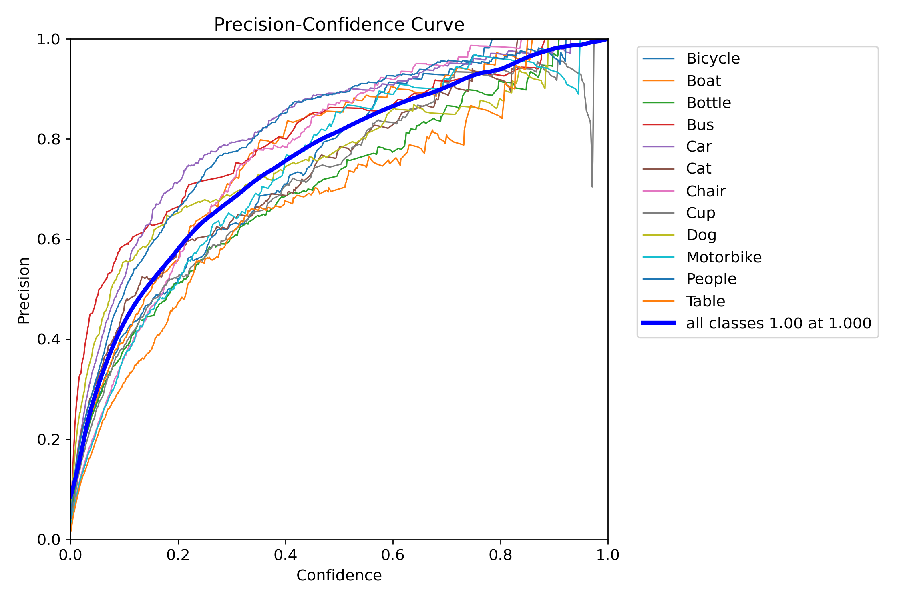
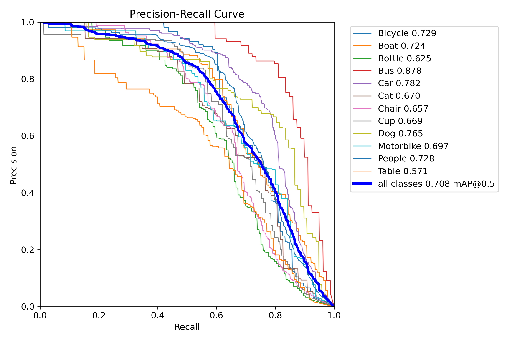
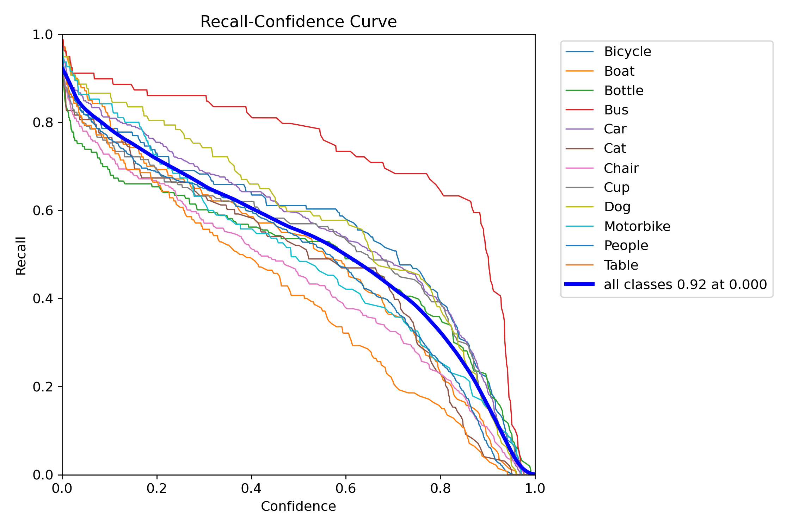
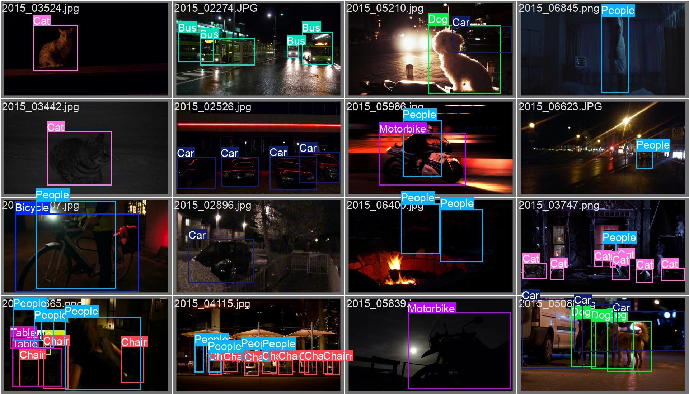
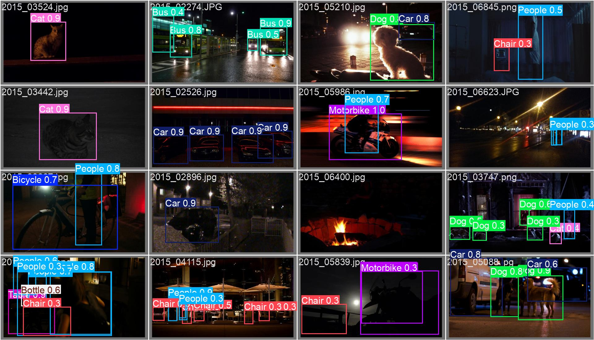

# 结果分析
## 训练

在十轮训练的结果中可以看到，模型的收敛情况较好，召回率也逐渐增加，如果增加训练轮数还会提高模型的准确度。
训练评估

从训练评估中可以看出，该模型的总体mAP@50为0.708，mAP@50-95为0.454，这表明模型在检测物体方面具有较好的性能。

对于不同的类别，模型的性能存在一定的差异。例如，对于“Bus”类别的mAP@50达到了0.878，而“Bottle”类别的mAP@50仅为0.625。这种差异可能由多种因素导致，如数据集中某些类别的样本数量较少、低光照导致物体的特征较为相似或复杂等。

此外，速度方面，预处理时间为0.1ms，推理时间为0.7ms，损失计算时间为0.0ms，后处理时间为0.3ms，这意味着模型在实际应用中可以快速地处理图像并给出预测结果。
## 模型评估

从混淆矩阵中可以看到，十轮训练得到的模型对`Bus`这一类别识别的效果较好，对`Table`识别较差

从F1和置信度的关系曲线中，我们也可以得到同样的结论，并且从曲线中也可以看出模型还应该进一步训练。

从以上三组曲线可以看出来，初步训练的模型还是比较有效的。
## 结果对比
我们抽取部分测试集的案例进行结果的对比分析 
真值：

预测：

可以看到在一行四列图像的预测中，多预测出了一个`Chair`类别。在三行三列的图像中少预测出了两个`People`类别。四行三列中多预测了一个`Chair`类别。这都是由于低光照导致的。 
在三行四列和四行一列的多类别低光照图像中，出现了类别错误的问题，这也是由于低光照导致的图像信息不足导致的。

